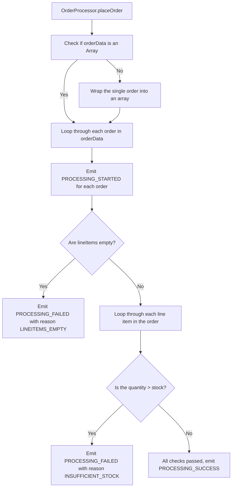

```
# Event Emitter: Order Processing

You have been given the task to write an Order-Processing Script that takes the order data as input, performs a few pre-order checks/validations, and returns the result. If any line-item in the order data does not pass the pre-order checks, the order should fail, and the corresponding failure event should be fired.

## Class Definition

Create a module, processor.js, and implement the following set of functionalities:
- The file should export a class OrderProcessor as the default export of the module, and it should inherit from the EventEmitter class.

### Methods:
- `placeOrder`: Accepts the order data as an argument and immediately starts performing the validations on it. The orderData passed to the function should have the following properties/shape:
```json
[
 {
    "orderNumber": "OD2323", // Order Number of the order
    "lineItems": [ // Array containing the lineItems in the order
        {
            "itemId": 3, // ID of the line Item. 
            "quantity": 4 // The quantity requested in the order
        },
        {
            "itemId": 5,
            "quantity": 4
        }
    ]
 }
]
```
### Events:

The class should emit the following events
  - `PROCESSING_STARTED`: Should be fired just before the validations are started for an order. The order number of the current order should be passed to the callback of the event handler.
  - `PROCESSING_FAILED`: Should be fired if, for any reason, the pre-order checks do not pass. The callback of the event handler will accept an object containing the following properties:
    - `orderNumber`: The orderNumber of the order that failed to process.
    - `itemId`: The ID of the first matching item that failed to process.
    - `reason`: The reason why the processing failed. It can be one of `INSUFFICIENT_STOCK` or `LINEITEMS_EMPTY`.
      - If the lineItems property is a blank array, the check should fail with the reason `LINEITEMS_EMPTY`. The itemId property need not be passed to the errorObject in this scenario.
      - If any of the lineItems' requested quantity is more than the matching stock property in the stockData array, the check should fail with the reason `INSUFFICIENT_STOCK`.
  - `PROCESSING_SUCCESS`: Should be fired if all the pre-order checks pass. The order number of the current order should be passed to the callback of the event handler.
 
 ---
 
The file containing the current stock information, stock-list.json, is added to the root of the project and can be used for validation. An explanation of an entry in the JSON array is as follows:
  - `id`: The ID of the item for which stock information is stored.
  - `stock`: The current stock count of the item. 
  
```json
[
  {
    "id": 0,
    "stock": 4
  },
  {
    "id": 1,
    "stock": 12
  },
...
]
```

_Note: It can be assumed that lineitems passed to the placeOrder function will always be an array, and the ID of the lineItem passed will always be present in the stock list. No extra code is required for these conditions._

### Example Implementation

Please open the file `index.js` for example implementation.

## Project Specifications

**Read-Only Paths**
- test

**Commands**
- run: `npm start`
- install: `npm install`
- test: `npm test`
```

The error you're encountering (`TypeError: orderData.forEach is not a function`) is because the `placeOrder` function is expecting `orderData` to be an array. However, it seems like `orderData` is being passed as a single object rather than an array of objects.

To fix this, you need to ensure that `placeOrder` is always passed an array of orders, or update the method to handle both a single object and an array of objects.

Here’s how you can modify the `placeOrder` method in `processor.js` to handle both cases:

### Updated `processor.js`

```jsx
const EventEmitter = require('events');
const fs = require('fs');

// Reading the stock-list.json file
const stockData = JSON.parse(fs.readFileSync('stock-list.json', 'utf-8'));

class OrderProcessor extends EventEmitter {
  placeOrder(orderData) {
    // Ensure orderData is always an array
    const orders = Array.isArray(orderData) ? orderData : [orderData];

    orders.forEach(order => {
      const { orderNumber, lineItems } = order;

      // Emit PROCESSING_STARTED event
      this.emit('PROCESSING_STARTED', orderNumber);

      // Check if lineItems is empty
      if (lineItems.length === 0) {
        this.emit('PROCESSING_FAILED', {
          orderNumber,
          reason: 'LINEITEMS_EMPTY'
        });
        return; // Stop processing further if the order fails
      }

      // Loop through each line item to check stock
      for (const item of lineItems) {
        const stockItem = stockData.find(stock => stock.id === item.itemId);

        if (item.quantity > stockItem.stock) {
          // Emit PROCESSING_FAILED event due to insufficient stock
          this.emit('PROCESSING_FAILED', {
            orderNumber,
            itemId: item.itemId,
            reason: 'INSUFFICIENT_STOCK'
          });
          return; // Stop processing further if the order fails
        }
      }

      // If all checks pass, emit PROCESSING_SUCCESS event
      this.emit('PROCESSING_SUCCESS', orderNumber);
    });
  }
}

module.exports = OrderProcessor;

```

### Key Fix:

- **Handle both single object and array**: The `placeOrder` method now checks whether `orderData` is an array or a single object. If it's a single object, it wraps it into an array using `Array.isArray(orderData) ? orderData : [orderData]`.

### Why It Works:

- If a single order object is passed, it will be converted into an array with one element, so the `forEach` method will work as expected.
- If an array of orders is passed, it will proceed as before.

### Example Usage:

This updated method should now resolve the `forEach` errors and allow the `placeOrder` method to process both single and multiple orders.

You can re-run your tests, and it should work properly for both single and multiple orders.

