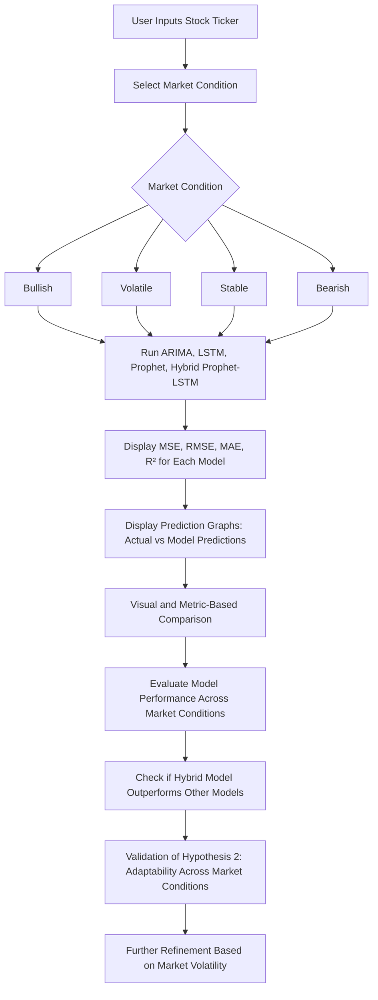

# Hypothesis2

### Explanation:

1. **User Input Section**:
    - The user inputs the **stock ticker** and selects the **market condition** (Bullish, Volatile, Stable, Bearish) from a dropdown.
2. **Market Condition Branch**:
    - Based on the market condition chosen (Bullish, Volatile, Stable, Bearish), the models (ARIMA, LSTM, Prophet, Hybrid Prophet-LSTM) are executed under that scenario.
3. **Model Execution**:
    - All four models (ARIMA, LSTM, Prophet, Hybrid Prophet-LSTM) run simultaneously after the user selects a condition.
4. **Model Results Section**:
    - The performance metrics (MSE, RMSE, MAE, R²) for each model are displayed.
    - A graph showing the actual stock prices vs. the predictions from each model is generated.
5. **Model Comparison and Evaluation**:
    - The user can visually and numerically compare the performance of each model.
    - This helps evaluate which model performs better under specific market conditions.
6. **Hypothesis Validation**:
    - After comparing the models, check if the **Hybrid Prophet-LSTM model** outperforms other models, particularly under different market conditions.
    - This step is crucial for validating **Hypothesis 2**, which states that the hybrid model should demonstrate better adaptability across various market environments.
7. **Refinement**:
    - Based on the analysis, further refinement of the model can be done, especially with respect to handling market volatility.

This **Mermaid diagram** shows the flow from user input, through model execution, to the evaluation and validation of **Hypothesis 2** regarding model adaptability across different market conditions. You can easily paste this into Notion to display the process visually.