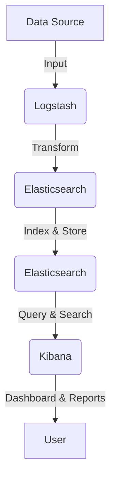

### **ElasticSearch & ELK Stack Overview**  

#### **🔎 Key Features of ElasticSearch**  
- **JSON-Based Data Store**  
- **RESTful API**  
- **Handles Logs, Metrics, and App Telemetry**  

---

### **💡 RDBMS vs ElasticSearch Comparison**
| **RDBMS** | **ElasticSearch** |
|------------|------------------|
| **Database (DB)** | **Indexes/Indices** |
| **Tables** | **Patterns/Types** |
| **Rows** | **Documents** |
| **Columns** | **Fields** |

📌 **Key Takeaway:**  
ElasticSearch is **schema-less**, storing data as **JSON documents**, making it flexible and optimized for search.

---

### **📊 ELK Stack Components**
**1️⃣ Logstash (LG) - Data Processing**  
   - **Input:** Collects data (logs, events, metrics)  
   - **Transform:** Parses, filters, formats  
   - **Stash:** Stores processed data in ElasticSearch  

**2️⃣ Elasticsearch (ES) - Storage & Search**  
   - Indexes and stores data  
   - Supports full-text search and real-time analysis  

**3️⃣ Kibana (K) - Visualization**  
   - **UI Dashboard** for interactive data monitoring  
   - **Widgets & Visualizations** for analytics  

---

### **🔄 Data Flow**

📌 **Process Flow:**  
1. **Data (Logs, Metrics, etc.)** → **Logstash processes it**  
2. **Logstash** transforms and sends data to **Elasticsearch**  
3. **Elasticsearch** indexes and stores it for fast search  
4. **Kibana** visualizes data for easy analysis  

---

### **🧠 Quick Memory Trick**  
**"Logstash IN, Elastic Stores, Kibana Shows!"** 🚀  

