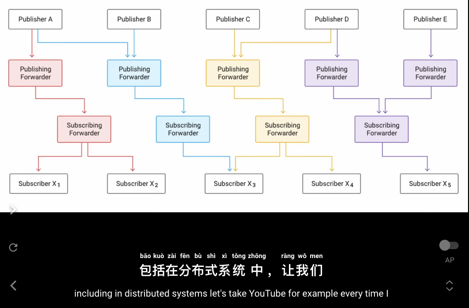
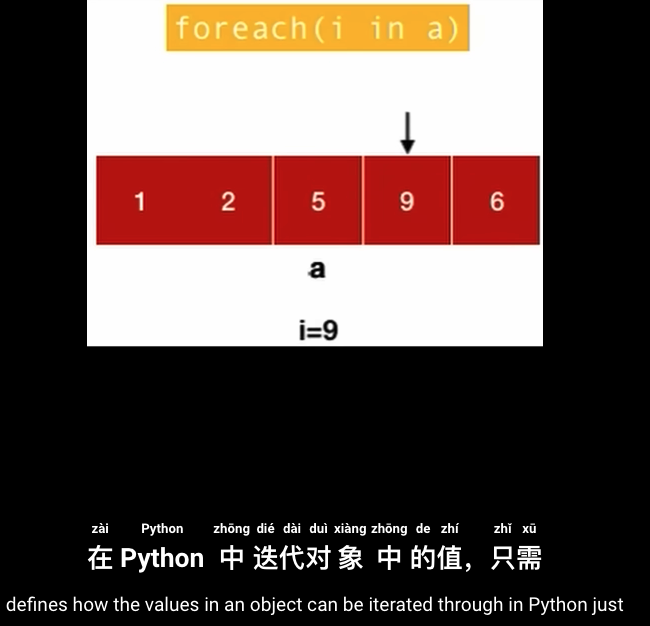
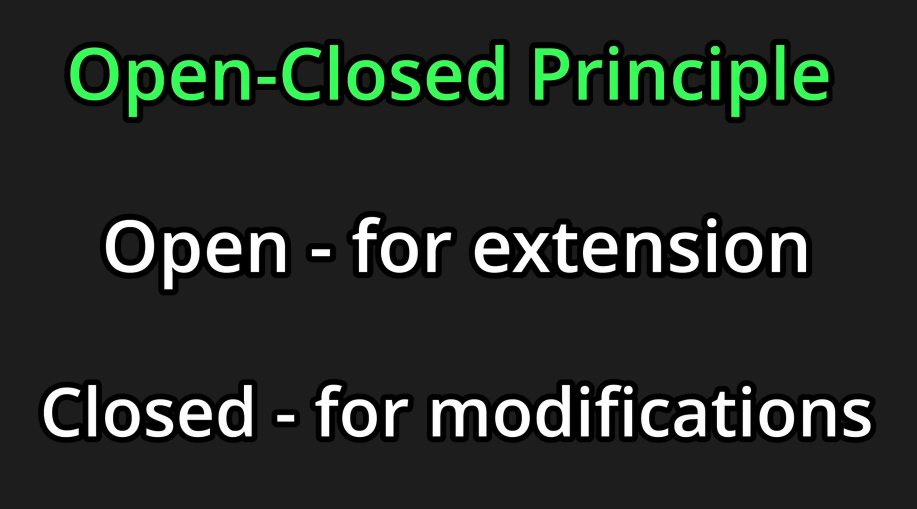
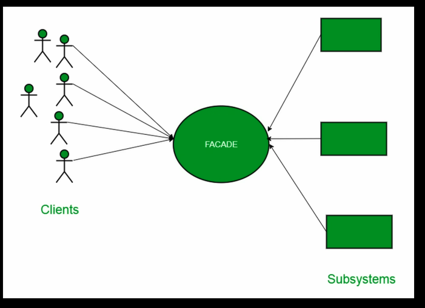

# 1. Creational Patterns
# 1.1 Factory
# 1.2 Builder
# 1.3 Singleton

# 2. Behavioual Patterns
# 2.1 Observer / PubSub
# 2.2 Iterator
# 2.3 Open-Close Principle: Strategy Patterns
# 2.4 Structural Patterns (Facade)
# 2.5 Adaptor

''''''